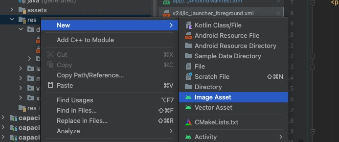
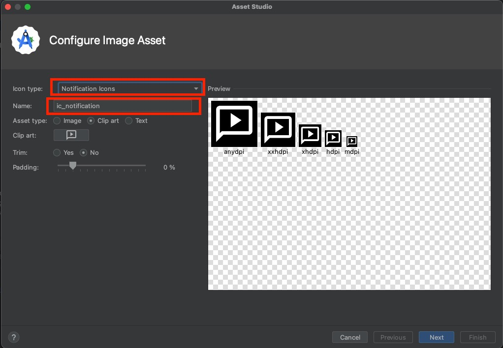
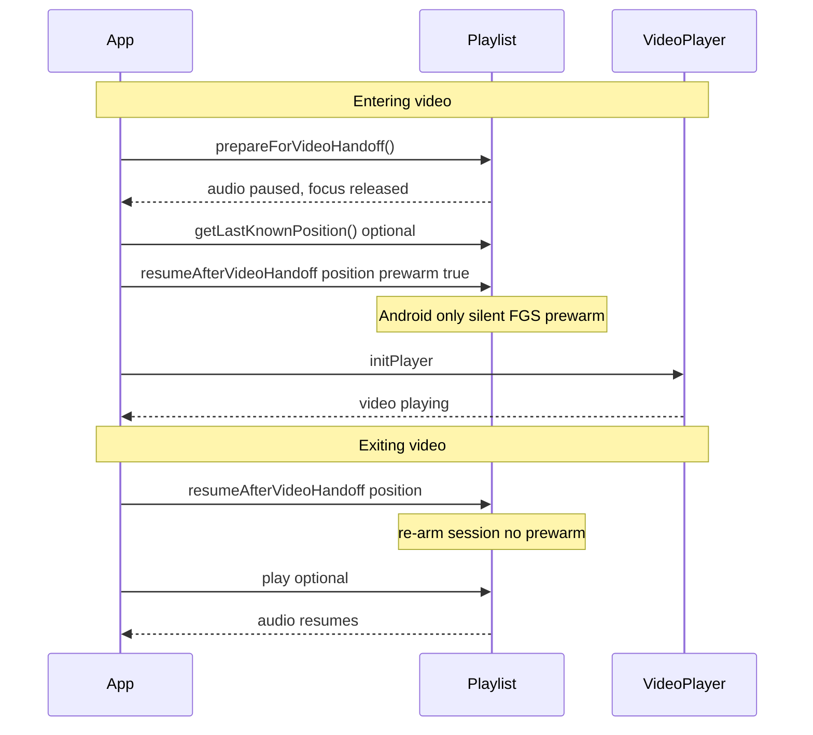

# capacitor-plugin-playlist

Capacitor plugin for **Android**, **iOS**, and **Web** with native audio playlist playback, background support, lock-screen / notification controls, and video handoff.

Requires **Capacitor 8+** (peer dependency `@capacitor/core >= 8.0.0`).

## Index

1. [Features](#features)
2. [Background](#background)
3. [Notes](#notes)
4. [Installation](#installation)
5. [Usage](#usage)
6. [Events](#events)
7. [Video handoff](#video-handoff)
8. [API](#api)
9. [Migrating from cordova-plugin-playlist](#migrating-from-cordova-plugin-playlist)
10. [Changes](#changes)
11. [Credits](#credits)
12. [License](#license)

## Features

### Playlist management

- `setPlaylistItems` — replace entire playlist (optional position retention)
- `addItem` / `addAllItems` — append tracks
- `removeItem` / `removeItems` / `clearAllItems` — remove tracks
- `getPlaylist` — snapshot of current items
- `setLoop` — loop entire playlist when the last track completes

### Playback controls

- `play` / `pause`
- `skipForward` / `skipBack`
- `seekTo` (seconds)
- `playTrackByIndex` / `playTrackById` — jump and play
- `selectTrackByIndex` / `selectTrackById` — select without playing
- `setPlaybackVolume` (0–1)
- `setPlaybackRate` (0 pauses, 1 = normal speed)

### Native platform integration

| Platform | Engine | OS controls |
|----------|--------|-------------|
| Android | [ExoMedia](https://github.com/brianwernick/ExoMedia) + [PlaylistCore](https://github.com/brianwernick/PlaylistCore) | MediaStyle notification, MediaSession, foreground `mediaPlayback` service |
| iOS | Custom `AVBidirectionalQueuePlayer` | Lock screen + Control Center via `MPNowPlayingInfoCenter` / `MPRemoteCommandCenter` |
| Web | HTMLAudioElement + optional HLS.js | Browser media controls only |

### Background audio

- Android: foreground media service with `WAKE_LOCK` and `FOREGROUND_SERVICE_MEDIA_PLAYBACK` (Android 14+)
- iOS: `UIBackgroundModes` → `audio`
- Position events throttled while WebView is backgrounded; one live snapshot emitted on foreground resume (0.9.1+)

### Tracks and sources

- Remote URLs, local files (`file://` or app-resolved paths), and streams
- Set `isStream: true` on streaming URLs so pause/resume buffering behaves correctly
- `albumArt` shown in notification / lock screen (Glide on Android)
- No built-in download manager — resolve offline paths in your app and pass them as `assetUrl`

### Status event stream

Single `status` listener with `RmxAudioStatusMessage` events (see [Events](#events)).

### Video handoff

When switching from background audio to native fullscreen video:

- `prepareForVideoHandoff()` — release audio focus / session
- `getLastKnownPosition()` — saved head position (seconds)
- `resumeAfterVideoHandoff({ position, prewarm? })` — re-arm audio after video

See [Video handoff](#video-handoff).

### Cordova-compatible wrapper

`RmxAudioPlayer` (`src/RmxAudioPlayer.ts`) is a drop-in replacement for cordova-plugin-playlist with `on('status')` / `off('status')` and state getters (`isPlaying`, `currentTrack`, etc.).

**Not exposed on `RmxAudioPlayer`:** `getPlaylist`, video handoff methods — call `Playlist` directly for those.

### Not supported

- Shuffle
- Reorder API
- Mixable / low-latency game audio (use [cordova-plugin-nativeaudio](https://github.com/floatinghotpot/cordova-plugin-nativeaudio) instead)
- Simultaneous audio mixing (lock-screen controls require exclusive audio focus)

## Background

Forked from [cordova-plugin-playlist](https://github.com/Rolamix/cordova-plugin-playlist) for Capacitor.

## Notes

### Android

Uses ExoMedia (ExoPlayer wrapper) with PlaylistCore for notification and MediaSession integration.

### iOS

Uses a customized AVQueuePlayer (`AVBidirectionalQueuePlayer`) for track-change feedback and continuous audio session between songs. Minimum iOS **18** (0.9.4+). Swift Package Manager supported (0.10.0+).

## Installation

```
npm i capacitor-plugin-playlist
npx cap sync
```

### Web

Include HLS.js in your build for HLS streams.

#### Angular example

```
npm i hls.js
```

Add to `angular.json` → architect → build → options → scripts:

```json
"scripts": [
  {
    "input": "node_modules/hls.js/dist/hls.min.js"
  }
]
```

### Android

#### AndroidManifest.xml

```xml
<uses-permission android:name="android.permission.WAKE_LOCK" />
<uses-permission android:name="android.permission.FOREGROUND_SERVICE_MEDIA_PLAYBACK" />
<application android:name="org.dwbn.plugins.playlist.App">
    <service android:enabled="true" android:exported="false"
             android:foregroundServiceType="mediaPlayback"
             android:name="org.dwbn.plugins.playlist.service.MediaService">
    </service>
</application>
```

#### Gradle 9+

Ensure the Kotlin plugin is declared in your root `android/build.gradle` (this plugin no longer ships its own `buildscript` block):

```gradle
buildscript {
    ext.kotlin_version = '2.3.0'
    repositories {
        google()
        mavenCentral()
    }
    dependencies {
        classpath 'com.android.tools.build:gradle:8.13.2'
        classpath "org.jetbrains.kotlin:kotlin-gradle-plugin:$kotlin_version"
    }
}
ext {
    kotlin_version = '2.3.0'
}
```

#### Glide (notification album art)

Create `MyAppGlideModule.java`:

```java
package org.your.package.namespace;

import com.bumptech.glide.annotation.GlideModule;
import com.bumptech.glide.module.AppGlideModule;

@GlideModule
public final class MyAppGlideModule extends AppGlideModule {}
```

See https://guides.codepath.com/android/Displaying-Images-with-the-Glide-Library

#### Notification icon

Create a transparent silhouette icon (e.g. `ic_notification.png`) and pass it via `setOptions`:

```typescript
await Playlist.setOptions({
  verbose: !environment.production,
  options: { icon: 'ic_notification' },
});
```

In Android Studio: right-click `res` → New → Image Asset → Notification Icons.





### iOS

Add to `Info.plist`:

```xml
<key>UIBackgroundModes</key>
<array>
    <string>audio</string>
    <string>fetch</string>
</array>
```

Without `audio` background mode, iOS stops playback when the app backgrounds.

## Usage

See also `examples/audio-provider.ts` for an Angular/Ionic integration.

### Basic flow (`Playlist` API)

```typescript
import { Playlist, AudioTrack, RmxAudioStatusMessage } from 'capacitor-plugin-playlist';

await Playlist.setOptions({
  verbose: true,
  resetStreamOnPause: true,
  options: { icon: 'ic_notification' },
});

await Playlist.initialize();

const handle = await Playlist.addListener('status', ({ status }) => {
  if (status.msgType === RmxAudioStatusMessage.RMXSTATUS_PLAYBACK_POSITION) {
    // update UI progress
  }
});

const track: AudioTrack = {
  trackId: 'track-1',
  assetUrl: 'https://example.com/audio.mp3',
  title: 'Track title',
  artist: 'Artist name',
  album: 'Album name',
  albumArt: 'https://example.com/cover.jpg',
  isStream: false,
};

await Playlist.setPlaylistItems({
  items: [track],
  options: { startPaused: false },
});

await Playlist.play();
// later: handle.remove();
```

### `RmxAudioPlayer` wrapper (Cordova migration)

```typescript
import { RmxAudioPlayer, AudioTrack } from 'capacitor-plugin-playlist';

const player = new RmxAudioPlayer();
await player.initialize();

player.on('status', (data) => {
  console.log('status', data.msgType, data);
});

await player.setLoop(true);
await player.setPlaylistItems([track], { retainPosition: true, playFromId: track.trackId });
await player.play();
```

## Events

Subscribe via `Playlist.addListener('status', …)` or `RmxAudioPlayer.on('status', …)`.

Each callback receives `{ action: 'status', status: OnStatusCallbackData }` where:

- `status.trackId` — current track id, `"NONE"` when idle, `"INVALID"` when playlist completed
- `status.msgType` — `RmxAudioStatusMessage` enum value
- `status.value` — payload (shape depends on `msgType`)

| msgType | Name | When | Payload |
|---------|------|------|---------|
| 5 | ERROR | Playback or network failure | `OnStatusErrorCallbackData` (`code`, `message`) |
| 10 | LOADING | Track loading started | `OnStatusCallbackUpdateData` |
| 11 | CANPLAY | Track ready to play | `OnStatusCallbackUpdateData` |
| 15 | LOADED | Track fully loaded | `OnStatusCallbackUpdateData` |
| 20 | STALLED | iOS: network stall | `OnStatusCallbackUpdateData` |
| 25 | BUFFERING | Buffer progress update | `OnStatusCallbackUpdateData` |
| 30 | PLAYING | Playback started/resumed | `OnStatusCallbackUpdateData` |
| 35 | PAUSE | Playback paused | `OnStatusCallbackUpdateData` |
| 40 | PLAYBACK_POSITION | Periodic position tick | `OnStatusCallbackUpdateData` (suppressed while WebView backgrounded) |
| 45 | SEEK | User or app seeked | `OnStatusCallbackUpdateData` |
| 50 | COMPLETED | Current track finished | `OnStatusCallbackUpdateData` |
| 55 | DURATION | Duration first known | `OnStatusCallbackUpdateData` |
| 60 | STOPPED | All playback stopped | `OnStatusCallbackUpdateData` |
| 90 | SKIP_FORWARD | Skipped to next track | `OnStatusCallbackUpdateData` |
| 95 | SKIP_BACK | Skipped to previous track | `OnStatusCallbackUpdateData` |
| 100 | TRACK_CHANGED | Active track changed | `OnStatusTrackChangedData` |
| 105 | PLAYLIST_COMPLETED | Entire playlist finished | `OnStatusCallbackUpdateData` |
| 110 | ITEM_ADDED | Track added | `OnStatusCallbackUpdateData` |
| 115 | ITEM_REMOVED | Track removed | `OnStatusCallbackUpdateData` |
| 120 | PLAYLIST_CLEARED | All tracks removed | `OnStatusCallbackUpdateData` |

For track changes, prefer handling `TRACK_CHANGED` over `SKIP_FORWARD` / `SKIP_BACK`.

## Video handoff

Native audio and native fullscreen video cannot share audio focus. These three methods coordinate a clean handoff when the user opens video while audio was playing (or when switching back to audio after video).

Works with any native Capacitor video plugin (or other player) that needs exclusive audio focus.

### Methods

| Method | Purpose |
|--------|---------|
| `prepareForVideoHandoff()` | Pause audio, capture head position, release audio focus / session |
| `getLastKnownPosition()` | Read captured position (seconds) after prepare |
| `resumeAfterVideoHandoff({ position, prewarm? })` | Re-arm audio after video, or prewarm Android FGS before video |

Call these on the `Playlist` plugin directly — they are **not** exposed on `RmxAudioPlayer`.

### Lifecycle



### Basic sequence

```typescript
import { Playlist } from 'capacitor-plugin-playlist';

// --- Entering native video ---
await Playlist.prepareForVideoHandoff();
const { position: audioPosition } = await Playlist.getLastKnownPosition();

await nativeVideoPlayer.init({ /* url, fullscreen, … */ });

// --- Exiting native video (use video head, not audioPosition) ---
const videoPosition = 120; // from your video player's position events
await Playlist.resumeAfterVideoHandoff({ position: videoPosition });
await Playlist.play(); // if user should resume audible playback
```

### Recommended Android sequence (with prewarm)

On Android 14+ (especially Android 17), starting or re-promoting the media foreground service from the background can fail or mute playback. **Prewarm while the app is still visible** before video starts:

```typescript
// 1. Release audio focus
await Playlist.prepareForVideoHandoff();

// 2. Prewarm FGS silently at the video start position (Android)
await Playlist.resumeAfterVideoHandoff({
  position: Math.floor(videoStartSec),
  prewarm: true,
});

// 3. Start native video
await nativeVideoPlayer.init({ /* … */ });

// … user watches video; track video position via player events …

// 4. After video closes — re-arm without prewarm
await Playlist.resumeAfterVideoHandoff({ position: Math.floor(videoExitSec) });
await Playlist.play(); // when ready
```

**What `prewarm: true` does on Android:**

- Promotes `MediaService` to foreground (`mediaPlayback` FGS) while the app is foregrounded
- Prepares the playlist item at `position` but stays **silent** — no audio focus request, no audible playback
- Prevents video sound from dropping when audio would otherwise re-request focus
- During prewarm, `Playlist.play()` is a no-op for audible playback (only keeps FGS notification updated)

**iOS:** `prewarm` is accepted but ignored. Use `prepareForVideoHandoff()` → video → `resumeAfterVideoHandoff({ position })` → `play()`.

**Web:** Both methods are stubs (pause + store position). No native session handoff.

### Platform behaviour

| Step | Android | iOS | Web |
|------|---------|-----|-----|
| `prepareForVideoHandoff` | Pause, abandon audio focus, store position via `MediaProgress` | Pause, store track time, `AVAudioSession.setActive(false)` | Pause HTMLAudioElement, store `currentTime` |
| `getLastKnownPosition` | Returns stored handoff position (seconds) | Same | Same |
| `resumeAfterVideoHandoff` (no prewarm) | Re-request focus; in-place resume if FGS still foreground from prewarm, else `beginPlayback` | Reactivate audio session; reset track-id guard for PLAYING events | Store position only |
| `resumeAfterVideoHandoff` (prewarm) | Silent FGS + prepare at position, no focus/play | No-op | N/A |
| After resume | Call `play()` to start audible playback | Call `play()` to start audible playback | Call `play()` on web player |

### Position: audio vs video head

- **`getLastKnownPosition()`** after `prepareForVideoHandoff` — last **audio** head before video opened. Useful if video never started or for debugging.
- **On video exit** — pass the **video** playback position (from your video player's position events), not the stale audio position, so audio resumes where the user left off in the video timeline.
- Track video head while video plays and persist it if the app may cold-start (e.g. after PiP dismiss on Android).

### Integration checklist

1. Call `prepareForVideoHandoff()` **immediately before** your native video player starts — never after.
2. On Android, call `resumeAfterVideoHandoff({ position, prewarm: true })` **after prepare and before video init**, while the WebView is still foregrounded.
3. On video exit, call `resumeAfterVideoHandoff({ position })` **without** `prewarm`, then `play()` if playback should resume.
4. `resumeAfterVideoHandoff` must complete before `seekTo()` / `play()` on the audio side.
5. Do not call `Playlist.release()` between prepare and resume unless you intend to tear down the native player entirely.
6. Idempotent exit handling: guard against duplicate `resumeAfterVideoHandoff` calls from concurrent native exit events (merge to a single call with `max(position)`).

### Common pitfalls

| Symptom | Likely cause |
|---------|----------------|
| Video has no sound shortly after start | Audio re-requested focus after prepare; use Android `prewarm: true` before video starts |
| Audio silent after long video session | FGS stopped while backgrounded; prewarm before video + in-place resume on exit (0.8.10+) |
| JS stuck in PAUSED after video (iOS, index > 0) | Missing `play()` after resume, or PLAYING event suppressed — fixed in 0.8.11 |
| `PLAYBACK_POSITION` flood after background | Expected — position events suppressed while WebView backgrounded (0.9.1+) |

See [CHANGELOG.md](./CHANGELOG.md) for version-specific fixes (0.8.8–0.10.3).

## API

<docgen-index>

* [`addListener('status', ...)`](#addlistenerstatus-)
* [`setOptions(...)`](#setoptions)
* [`initialize()`](#initialize)
* [`release()`](#release)
* [`setPlaylistItems(...)`](#setplaylistitems)
* [`addItem(...)`](#additem)
* [`addAllItems(...)`](#addallitems)
* [`removeItem(...)`](#removeitem)
* [`removeItems(...)`](#removeitems)
* [`clearAllItems()`](#clearallitems)
* [`getPlaylist()`](#getplaylist)
* [`play()`](#play)
* [`pause()`](#pause)
* [`skipForward()`](#skipforward)
* [`skipBack()`](#skipback)
* [`seekTo(...)`](#seekto)
* [`playTrackByIndex(...)`](#playtrackbyindex)
* [`playTrackById(...)`](#playtrackbyid)
* [`selectTrackByIndex(...)`](#selecttrackbyindex)
* [`selectTrackById(...)`](#selecttrackbyid)
* [`setPlaybackVolume(...)`](#setplaybackvolume)
* [`setLoop(...)`](#setloop)
* [`setPlaybackRate(...)`](#setplaybackrate)
* [`prepareForVideoHandoff()`](#prepareforvideohandoff)
* [`resumeAfterVideoHandoff(...)`](#resumeaftervideohandoff)
* [`getLastKnownPosition()`](#getlastknownposition)
* [Interfaces](#interfaces)
* [Type Aliases](#type-aliases)
* [Enums](#enums)

</docgen-index>

<docgen-api>
<!--Update the source file JSDoc comments and rerun docgen to update the docs below-->

### addListener('status', ...)

```typescript
addListener(eventName: 'status', listenerFunc: PlaylistStatusChangeCallback) => Promise<PluginListenerHandle>
```

Subscribe to native playback status events (track changes, position, errors, etc.).

| Param              | Type                                                                                  | Description                                                                                                                       |
| ------------------ | ------------------------------------------------------------------------------------- | --------------------------------------------------------------------------------------------------------------------------------- |
| **`eventName`**    | <code>'status'</code>                                                                 | Must be `'status'`.                                                                                                               |
| **`listenerFunc`** | <code><a href="#playliststatuschangecallback">PlaylistStatusChangeCallback</a></code> | Callback receiving `{ action, status }` where `status.msgType` is a <a href="#rmxaudiostatusmessage">`RmxAudioStatusMessage`</a>. |

**Returns:** <code>Promise&lt;<a href="#pluginlistenerhandle">PluginListenerHandle</a>&gt;</code>

--------------------


### setOptions(...)

```typescript
setOptions(options: AudioPlayerOptions) => Promise<void>
```

Configure plugin behaviour (verbose logging, stream pause handling, notification icon).
Can be called at any time; not required before playback.

| Param         | Type                                                              |
| ------------- | ----------------------------------------------------------------- |
| **`options`** | <code><a href="#audioplayeroptions">AudioPlayerOptions</a></code> |

--------------------


### initialize()

```typescript
initialize() => Promise<void>
```

Initialise the native player, register status callbacks, and arm lock-screen / notification controls.
Call once before playback (e.g. on app start).

--------------------


### release()

```typescript
release() => Promise<void>
```

Tear down native resources (audio session, media service, observers).
Call when the app no longer needs background audio (e.g. on logout).

--------------------


### setPlaylistItems(...)

```typescript
setPlaylistItems(options: PlaylistOptions) => Promise<void>
```

Replace the entire playlist. Clears all previous items.
Use `options.retainPosition` to keep the current track and playback position.

| Param         | Type                                                        |
| ------------- | ----------------------------------------------------------- |
| **`options`** | <code><a href="#playlistoptions">PlaylistOptions</a></code> |

--------------------


### addItem(...)

```typescript
addItem(options: AddItemOptions) => Promise<void>
```

Append a single track to the end of the playlist.

| Param         | Type                                                      |
| ------------- | --------------------------------------------------------- |
| **`options`** | <code><a href="#additemoptions">AddItemOptions</a></code> |

--------------------


### addAllItems(...)

```typescript
addAllItems(options: AddAllItemOptions) => Promise<void>
```

Append multiple tracks to the end of the playlist.
Raises one `RMXSTATUS_ITEM_ADDED` event per track.

| Param         | Type                                                            |
| ------------- | --------------------------------------------------------------- |
| **`options`** | <code><a href="#addallitemoptions">AddAllItemOptions</a></code> |

--------------------


### removeItem(...)

```typescript
removeItem(options: RemoveItemOptions) => Promise<void>
```

Remove a track by index (preferred) or id.
If the removed track is currently playing, the next track starts automatically.

| Param         | Type                                                            |
| ------------- | --------------------------------------------------------------- |
| **`options`** | <code><a href="#removeitemoptions">RemoveItemOptions</a></code> |

--------------------


### removeItems(...)

```typescript
removeItems(options: RemoveItemsOptions) => Promise<void>
```

Remove multiple tracks in a single batch.
If the currently playing track is removed, the next available track starts automatically.

| Param         | Type                                                              |
| ------------- | ----------------------------------------------------------------- |
| **`options`** | <code><a href="#removeitemsoptions">RemoveItemsOptions</a></code> |

--------------------


### clearAllItems()

```typescript
clearAllItems() => Promise<void>
```

Remove all tracks from the playlist. Raises `RMXSTATUS_PLAYLIST_CLEARED` and `RMXSTATUS_STOPPED`.

--------------------


### getPlaylist()

```typescript
getPlaylist() => Promise<GetPlaylistResult>
```

Return a snapshot of the current playlist items.

**Returns:** <code>Promise&lt;<a href="#getplaylistresult">GetPlaylistResult</a>&gt;</code>

--------------------


### play()

```typescript
play() => Promise<void>
```

Start or resume playback of the current track.
No-op if the playlist is empty.

--------------------


### pause()

```typescript
pause() => Promise<void>
```

Pause playback of the current track.

--------------------


### skipForward()

```typescript
skipForward() => Promise<void>
```

Skip to the next track. At the end of the playlist, wraps to the beginning when loop is enabled.

--------------------


### skipBack()

```typescript
skipBack() => Promise<void>
```

Skip to the previous track. No-op when already at the first track.

--------------------


### seekTo(...)

```typescript
seekTo(options: SeekToOptions) => Promise<void>
```

Seek to a position (seconds) in the currently playing track.
If the position exceeds track length, playback advances to the next track.

| Param         | Type                                                    |
| ------------- | ------------------------------------------------------- |
| **`options`** | <code><a href="#seektooptions">SeekToOptions</a></code> |

--------------------


### playTrackByIndex(...)

```typescript
playTrackByIndex(options: PlayByIndexOptions) => Promise<void>
```

Jump to the track at the given 0-based index and start playback.

| Param         | Type                                                              |
| ------------- | ----------------------------------------------------------------- |
| **`options`** | <code><a href="#playbyindexoptions">PlayByIndexOptions</a></code> |

--------------------


### playTrackById(...)

```typescript
playTrackById(options: PlayByIdOptions) => Promise<void>
```

Jump to the track with the given id and start playback.

| Param         | Type                                                        |
| ------------- | ----------------------------------------------------------- |
| **`options`** | <code><a href="#playbyidoptions">PlayByIdOptions</a></code> |

--------------------


### selectTrackByIndex(...)

```typescript
selectTrackByIndex(options: SelectByIndexOptions) => Promise<void>
```

Select the track at the given index without necessarily starting playback.

| Param         | Type                                                                  |
| ------------- | --------------------------------------------------------------------- |
| **`options`** | <code><a href="#selectbyindexoptions">SelectByIndexOptions</a></code> |

--------------------


### selectTrackById(...)

```typescript
selectTrackById(options: SelectByIdOptions) => Promise<void>
```

Select the track with the given id without necessarily starting playback.

| Param         | Type                                                            |
| ------------- | --------------------------------------------------------------- |
| **`options`** | <code><a href="#selectbyidoptions">SelectByIdOptions</a></code> |

--------------------


### setPlaybackVolume(...)

```typescript
setPlaybackVolume(options: SetPlaybackVolumeOptions) => Promise<void>
```

Set media stream volume. Float in range [0, 1].
Hardware volume controls still apply on top of this value.

| Param         | Type                                                                          |
| ------------- | ----------------------------------------------------------------------------- |
| **`options`** | <code><a href="#setplaybackvolumeoptions">SetPlaybackVolumeOptions</a></code> |

--------------------


### setLoop(...)

```typescript
setLoop(options: SetLoopOptions) => Promise<void>
```

When true, the playlist loops back to the first track after the last track completes.

| Param         | Type                                                      |
| ------------- | --------------------------------------------------------- |
| **`options`** | <code><a href="#setloopoptions">SetLoopOptions</a></code> |

--------------------


### setPlaybackRate(...)

```typescript
setPlaybackRate(options: SetPlaybackRateOptions) => Promise<void>
```

Set playback speed. Float value; 0 pauses, 1 is normal speed.

| Param         | Type                                                                      |
| ------------- | ------------------------------------------------------------------------- |
| **`options`** | <code><a href="#setplaybackrateoptions">SetPlaybackRateOptions</a></code> |

--------------------


### prepareForVideoHandoff()

```typescript
prepareForVideoHandoff() => Promise<void>
```

Release native audio session / focus so a video player can own playback.

**Android:** pauses current track, abandons audio focus, stores head position. Does not stop the foreground media service.
**iOS:** pauses, captures head position, deactivates `AVAudioSession` with `notifyOthersOnDeactivation`.
**Web:** pauses HTMLAudioElement and stores `currentTime`.

Call immediately before native video starts (e.g. your video plugin's init method).

--------------------


### resumeAfterVideoHandoff(...)

```typescript
resumeAfterVideoHandoff(options: ResumeAfterVideoHandoffOptions) => Promise<ResumeAfterVideoHandoffResult>
```

Re-arm native audio after video ends or, on Android, prewarm the media service before video starts.

**Without `prewarm` (typical exit path):**
- Android: when `play` is true (default), re-acquires focus and resumes at `position`. When `resumed` is `true`, JS should skip redundant `seekTo`/`play`. When `play` is false, clears handoff retain and returns `{ resumed: false }` so JS can seek without playing.
- iOS: restores pinned track, reactivates `AVAudioSession`, seeks to `position`, and when `play` is true starts playback (seek-then-play). Returns `{ resumed: true }` when native handled the handoff.
- Web: stores position only (no native session); returns `{ resumed: false }`.

**With `prewarm: true` (Android, before video):** starts `MediaService` in foreground at `position` but stays silent — no audio focus, no audible playback. Always returns `{ resumed: false }`.

| Param         | Type                                                                                      |
| ------------- | ----------------------------------------------------------------------------------------- |
| **`options`** | <code><a href="#resumeaftervideohandoffoptions">ResumeAfterVideoHandoffOptions</a></code> |

**Returns:** <code>Promise&lt;<a href="#resumeaftervideohandoffresult">ResumeAfterVideoHandoffResult</a>&gt;</code>

--------------------


### getLastKnownPosition()

```typescript
getLastKnownPosition() => Promise<GetLastKnownPositionResult>
```

Return the audio head position (seconds) captured during the most recent `prepareForVideoHandoff`
or passed to `resumeAfterVideoHandoff`.

**Returns:** <code>Promise&lt;<a href="#getlastknownpositionresult">GetLastKnownPositionResult</a>&gt;</code>

--------------------


### Interfaces


#### PluginListenerHandle

| Prop         | Type                                      |
| ------------ | ----------------------------------------- |
| **`remove`** | <code>() =&gt; Promise&lt;void&gt;</code> |


#### PlaylistStatusChangeCallbackArg

| Prop         | Type                                                                  |
| ------------ | --------------------------------------------------------------------- |
| **`action`** | <code>string</code>                                                   |
| **`status`** | <code><a href="#onstatuscallbackdata">OnStatusCallbackData</a></code> |


#### OnStatusCallbackData

Encapsulates the data received by an onStatus callback

| Prop          | Type                                                                                                                                                                                                                        | Description                                                                                                                                                                                                                                                   |
| ------------- | --------------------------------------------------------------------------------------------------------------------------------------------------------------------------------------------------------------------------- | ------------------------------------------------------------------------------------------------------------------------------------------------------------------------------------------------------------------------------------------------------------- |
| **`trackId`** | <code>string</code>                                                                                                                                                                                                         | The ID of this track. If the track is null or has completed, this value is "NONE" If the playlist is completed, this value is "INVALID"                                                                                                                       |
| **`msgType`** | <code><a href="#rmxaudiostatusmessage">RmxAudioStatusMessage</a></code>                                                                                                                                                     | The type of status update                                                                                                                                                                                                                                     |
| **`value`**   | <code><a href="#onstatuscallbackupdatedata">OnStatusCallbackUpdateData</a> \| <a href="#onstatustrackchangeddata">OnStatusTrackChangedData</a> \| <a href="#onstatuserrorcallbackdata">OnStatusErrorCallbackData</a></code> | The status payload. For all updates except ERROR, the data package is described by <a href="#onstatuscallbackupdatedata">OnStatusCallbackUpdateData</a>. For Errors, the data is shaped as <a href="#onstatuserrorcallbackdata">OnStatusErrorCallbackData</a> |


#### OnStatusCallbackUpdateData

Contains the current track status as of the moment an onStatus update event is emitted.

| Prop                  | Type                                                                               | Description                                                                                                                                                                                                                                                                                                                                               |
| --------------------- | ---------------------------------------------------------------------------------- | --------------------------------------------------------------------------------------------------------------------------------------------------------------------------------------------------------------------------------------------------------------------------------------------------------------------------------------------------------- |
| **`trackId`**         | <code>string</code>                                                                | The ID of this track corresponding to this event. If the track is null or has completed, this value is "NONE". This will happen when skipping to the beginning or end of the playlist. If the playlist is completed, this value is "INVALID"                                                                                                              |
| **`isStream`**        | <code>boolean</code>                                                               | Boolean indicating whether this is a streaming track.                                                                                                                                                                                                                                                                                                     |
| **`currentIndex`**    | <code>number</code>                                                                | The current index of the track in the playlist.                                                                                                                                                                                                                                                                                                           |
| **`status`**          | <code>'error' \| 'unknown' \| 'ready' \| 'playing' \| 'loading' \| 'paused'</code> | The current status of the track, as a string. This is used to summarize the various event states that a track can be in; e.g. "playing" is true for any number of track statuses. The Javascript interface takes care of this for you; this field is here only for reference.                                                                             |
| **`currentPosition`** | <code>number</code>                                                                | Current playback position of the reported track.                                                                                                                                                                                                                                                                                                          |
| **`duration`**        | <code>number</code>                                                                | The known duration of the reported track. For streams or malformed MP3's, this value will be 0.                                                                                                                                                                                                                                                           |
| **`playbackPercent`** | <code>number</code>                                                                | Progress of track playback, as a percent, in the range 0 - 100                                                                                                                                                                                                                                                                                            |
| **`bufferPercent`**   | <code>number</code>                                                                | Buffering progress of the track, as a percent, in the range 0 - 100                                                                                                                                                                                                                                                                                       |
| **`bufferStart`**     | <code>number</code>                                                                | The starting position of the buffering progress. For now, this is always reported as 0.                                                                                                                                                                                                                                                                   |
| **`bufferEnd`**       | <code>number</code>                                                                | The maximum position, in seconds, of the track buffer. For now, only the buffer with the maximum playback position is reported, even if there are other segments (due to seeking, for example). Practically speaking you don't need to worry about that, as in both implementations the minor gaps are automatically filled in by the underlying players. |


#### OnStatusTrackChangedData

Reports information about the playlist state when a track changes.
Includes the new track, its index, and the state of the playlist.

| Prop                | Type                                              | Description                                                                                                                |
| ------------------- | ------------------------------------------------- | -------------------------------------------------------------------------------------------------------------------------- |
| **`currentItem`**   | <code><a href="#audiotrack">AudioTrack</a></code> | The new track that has been selected. May be null if you are at the end of the playlist, or the playlist has been emptied. |
| **`currentIndex`**  | <code>number</code>                               | The 0-based index of the new track. If the playlist has ended or been cleared, this will be -1.                            |
| **`isAtEnd`**       | <code>boolean</code>                              | Indicates whether the playlist is now currently at the last item in the list.                                              |
| **`isAtBeginning`** | <code>boolean</code>                              | Indicates whether the playlist is now at the first item in the list                                                        |
| **`hasNext`**       | <code>boolean</code>                              | Indicates if there are additional playlist items after the current item.                                                   |
| **`hasPrevious`**   | <code>boolean</code>                              | Indicates if there are any items before this one in the playlist.                                                          |


#### AudioTrack

An audio track for playback by the playlist.

| Prop           | Type                 | Description                                                                                                                                                                                |
| -------------- | -------------------- | ------------------------------------------------------------------------------------------------------------------------------------------------------------------------------------------ |
| **`isStream`** | <code>boolean</code> | This item is a streaming asset. Make sure this is set to true for stream URLs, otherwise you will get odd behavior when the asset is paused.                                               |
| **`trackId`**  | <code>string</code>  | trackId is optional and if not passed in, an auto-generated UUID will be used.                                                                                                             |
| **`assetUrl`** | <code>string</code>  | URL of the asset; can be local, a URL, or a streaming URL. If the asset is a stream, make sure that isStream is set to true, otherwise the plugin can't properly handle the item's buffer. |
| **`albumArt`** | <code>string</code>  | The local or remote URL to an image asset to be shown for this track. If this is null, the plugin's default image is used.                                                                 |
| **`artist`**   | <code>string</code>  | The track's artist                                                                                                                                                                         |
| **`album`**    | <code>string</code>  | Album the track belongs to                                                                                                                                                                 |
| **`title`**    | <code>string</code>  | Title of the track                                                                                                                                                                         |


#### OnStatusErrorCallbackData

Represents an error reported by the onStatus callback.

| Prop          | Type                                                            | Description             |
| ------------- | --------------------------------------------------------------- | ----------------------- |
| **`code`**    | <code><a href="#rmxaudioerrortype">RmxAudioErrorType</a></code> | Error code              |
| **`message`** | <code>string</code>                                             | The error, as a message |


#### AudioPlayerOptions

Options governing the overall behavior of the audio player plugin

| Prop                     | Type                                                                | Description                                                                                                                                                                                                                                                                                                                                                                                                                   |
| ------------------------ | ------------------------------------------------------------------- | ----------------------------------------------------------------------------------------------------------------------------------------------------------------------------------------------------------------------------------------------------------------------------------------------------------------------------------------------------------------------------------------------------------------------------- |
| **`verbose`**            | <code>boolean</code>                                                | Should the plugin's javascript dump the status message stream to the javascript console?                                                                                                                                                                                                                                                                                                                                      |
| **`resetStreamOnPause`** | <code>boolean</code>                                                | If true, when pausing a live stream, play will continue from the LIVE POSITION (e.g. the stream jumps forward to the current point in time, rather than picking up where it left off when you paused). If false, the stream will continue where you paused. The drawback of doing this is that when the audio buffer fills, it will jump forward to the current point in time, cause a disjoint in playback. Default is true. |
| **`options`**            | <code><a href="#notificationoptions">NotificationOptions</a></code> | Further options for notifications                                                                                                                                                                                                                                                                                                                                                                                             |


#### NotificationOptions

| Prop       | Type                |
| ---------- | ------------------- |
| **`icon`** | <code>string</code> |


#### PlaylistOptions

| Prop          | Type                                                                                |
| ------------- | ----------------------------------------------------------------------------------- |
| **`items`**   | <code><a href="#array">Array</a>&lt;<a href="#audiotrack">AudioTrack</a>&gt;</code> |
| **`options`** | <code><a href="#playlistitemoptions">PlaylistItemOptions</a></code>                 |


#### Array

| Prop         | Type                | Description                                                                                            |
| ------------ | ------------------- | ------------------------------------------------------------------------------------------------------ |
| **`length`** | <code>number</code> | Gets or sets the length of the array. This is a number one higher than the highest index in the array. |

| Method             | Signature                                                                                                                     | Description                                                                                                                                                                                                                                 |
| ------------------ | ----------------------------------------------------------------------------------------------------------------------------- | ------------------------------------------------------------------------------------------------------------------------------------------------------------------------------------------------------------------------------------------- |
| **toString**       | () =&gt; string                                                                                                               | Returns a string representation of an array.                                                                                                                                                                                                |
| **toLocaleString** | () =&gt; string                                                                                                               | Returns a string representation of an array. The elements are converted to string using their toLocalString methods.                                                                                                                        |
| **pop**            | () =&gt; T \| undefined                                                                                                       | Removes the last element from an array and returns it. If the array is empty, undefined is returned and the array is not modified.                                                                                                          |
| **push**           | (...items: T[]) =&gt; number                                                                                                  | Appends new elements to the end of an array, and returns the new length of the array.                                                                                                                                                       |
| **concat**         | (...items: <a href="#concatarray">ConcatArray</a>&lt;T&gt;[]) =&gt; T[]                                                       | Combines two or more arrays. This method returns a new array without modifying any existing arrays.                                                                                                                                         |
| **concat**         | (...items: (T \| <a href="#concatarray">ConcatArray</a>&lt;T&gt;)[]) =&gt; T[]                                                | Combines two or more arrays. This method returns a new array without modifying any existing arrays.                                                                                                                                         |
| **join**           | (separator?: string \| undefined) =&gt; string                                                                                | Adds all the elements of an array into a string, separated by the specified separator string.                                                                                                                                               |
| **reverse**        | () =&gt; T[]                                                                                                                  | Reverses the elements in an array in place. This method mutates the array and returns a reference to the same array.                                                                                                                        |
| **shift**          | () =&gt; T \| undefined                                                                                                       | Removes the first element from an array and returns it. If the array is empty, undefined is returned and the array is not modified.                                                                                                         |
| **slice**          | (start?: number \| undefined, end?: number \| undefined) =&gt; T[]                                                            | Returns a copy of a section of an array. For both start and end, a negative index can be used to indicate an offset from the end of the array. For example, -2 refers to the second to last element of the array.                           |
| **sort**           | (compareFn?: ((a: T, b: T) =&gt; number) \| undefined) =&gt; this                                                             | Sorts an array in place. This method mutates the array and returns a reference to the same array.                                                                                                                                           |
| **splice**         | (start: number, deleteCount?: number \| undefined) =&gt; T[]                                                                  | Removes elements from an array and, if necessary, inserts new elements in their place, returning the deleted elements.                                                                                                                      |
| **splice**         | (start: number, deleteCount: number, ...items: T[]) =&gt; T[]                                                                 | Removes elements from an array and, if necessary, inserts new elements in their place, returning the deleted elements.                                                                                                                      |
| **unshift**        | (...items: T[]) =&gt; number                                                                                                  | Inserts new elements at the start of an array, and returns the new length of the array.                                                                                                                                                     |
| **indexOf**        | (searchElement: T, fromIndex?: number \| undefined) =&gt; number                                                              | Returns the index of the first occurrence of a value in an array, or -1 if it is not present.                                                                                                                                               |
| **lastIndexOf**    | (searchElement: T, fromIndex?: number \| undefined) =&gt; number                                                              | Returns the index of the last occurrence of a specified value in an array, or -1 if it is not present.                                                                                                                                      |
| **every**          | &lt;S extends T&gt;(predicate: (value: T, index: number, array: T[]) =&gt; value is S, thisArg?: any) =&gt; this is S[]       | Determines whether all the members of an array satisfy the specified test.                                                                                                                                                                  |
| **every**          | (predicate: (value: T, index: number, array: T[]) =&gt; unknown, thisArg?: any) =&gt; boolean                                 | Determines whether all the members of an array satisfy the specified test.                                                                                                                                                                  |
| **some**           | (predicate: (value: T, index: number, array: T[]) =&gt; unknown, thisArg?: any) =&gt; boolean                                 | Determines whether the specified callback function returns true for any element of an array.                                                                                                                                                |
| **forEach**        | (callbackfn: (value: T, index: number, array: T[]) =&gt; void, thisArg?: any) =&gt; void                                      | Performs the specified action for each element in an array.                                                                                                                                                                                 |
| **map**            | &lt;U&gt;(callbackfn: (value: T, index: number, array: T[]) =&gt; U, thisArg?: any) =&gt; U[]                                 | Calls a defined callback function on each element of an array, and returns an array that contains the results.                                                                                                                              |
| **filter**         | &lt;S extends T&gt;(predicate: (value: T, index: number, array: T[]) =&gt; value is S, thisArg?: any) =&gt; S[]               | Returns the elements of an array that meet the condition specified in a callback function.                                                                                                                                                  |
| **filter**         | (predicate: (value: T, index: number, array: T[]) =&gt; unknown, thisArg?: any) =&gt; T[]                                     | Returns the elements of an array that meet the condition specified in a callback function.                                                                                                                                                  |
| **reduce**         | (callbackfn: (previousValue: T, currentValue: T, currentIndex: number, array: T[]) =&gt; T) =&gt; T                           | Calls the specified callback function for all the elements in an array. The return value of the callback function is the accumulated result, and is provided as an argument in the next call to the callback function.                      |
| **reduce**         | (callbackfn: (previousValue: T, currentValue: T, currentIndex: number, array: T[]) =&gt; T, initialValue: T) =&gt; T          |                                                                                                                                                                                                                                             |
| **reduce**         | &lt;U&gt;(callbackfn: (previousValue: U, currentValue: T, currentIndex: number, array: T[]) =&gt; U, initialValue: U) =&gt; U | Calls the specified callback function for all the elements in an array. The return value of the callback function is the accumulated result, and is provided as an argument in the next call to the callback function.                      |
| **reduceRight**    | (callbackfn: (previousValue: T, currentValue: T, currentIndex: number, array: T[]) =&gt; T) =&gt; T                           | Calls the specified callback function for all the elements in an array, in descending order. The return value of the callback function is the accumulated result, and is provided as an argument in the next call to the callback function. |
| **reduceRight**    | (callbackfn: (previousValue: T, currentValue: T, currentIndex: number, array: T[]) =&gt; T, initialValue: T) =&gt; T          |                                                                                                                                                                                                                                             |
| **reduceRight**    | &lt;U&gt;(callbackfn: (previousValue: U, currentValue: T, currentIndex: number, array: T[]) =&gt; U, initialValue: U) =&gt; U | Calls the specified callback function for all the elements in an array, in descending order. The return value of the callback function is the accumulated result, and is provided as an argument in the next call to the callback function. |


#### ConcatArray

| Prop         | Type                |
| ------------ | ------------------- |
| **`length`** | <code>number</code> |

| Method    | Signature                                                          |
| --------- | ------------------------------------------------------------------ |
| **join**  | (separator?: string \| undefined) =&gt; string                     |
| **slice** | (start?: number \| undefined, end?: number \| undefined) =&gt; T[] |


#### PlaylistItemOptions

Options governing how the items are managed when using setPlaylistItems
to update the playlist. This is typically useful if you are retaining items
that were in the previous list.

| Prop                   | Type                 | Description                                                                                                                                                              |
| ---------------------- | -------------------- | ------------------------------------------------------------------------------------------------------------------------------------------------------------------------ |
| **`retainPosition`**   | <code>boolean</code> | If true, the plugin will continue playback from the current playback position after setting the items to the playlist.                                                   |
| **`playFromPosition`** | <code>number</code>  | If retainPosition is true, this value will tell the plugin the exact time to start from, rather than letting the plugin decide based on current playback.                |
| **`playFromId`**       | <code>string</code>  | If retainPosition is true, this value will tell the plugin the uid of the "current" item to start from, rather than letting the plugin decide based on current playback. |
| **`startPaused`**      | <code>boolean</code> | If playback should immediately begin when calling setPlaylistItems on the plugin. Default is false;                                                                      |


#### AddItemOptions

| Prop       | Type                                              |
| ---------- | ------------------------------------------------- |
| **`item`** | <code><a href="#audiotrack">AudioTrack</a></code> |


#### AddAllItemOptions

| Prop        | Type                                                                                |
| ----------- | ----------------------------------------------------------------------------------- |
| **`items`** | <code><a href="#array">Array</a>&lt;<a href="#audiotrack">AudioTrack</a>&gt;</code> |


#### RemoveItemOptions

| Prop        | Type                |
| ----------- | ------------------- |
| **`id`**    | <code>string</code> |
| **`index`** | <code>number</code> |


#### RemoveItemsOptions

| Prop        | Type                                                                                              |
| ----------- | ------------------------------------------------------------------------------------------------- |
| **`items`** | <code><a href="#array">Array</a>&lt;<a href="#removeitemoptions">RemoveItemOptions</a>&gt;</code> |


#### GetPlaylistResult

| Prop        | Type                                                                                |
| ----------- | ----------------------------------------------------------------------------------- |
| **`items`** | <code><a href="#array">Array</a>&lt;<a href="#audiotrack">AudioTrack</a>&gt;</code> |


#### SeekToOptions

| Prop           | Type                |
| -------------- | ------------------- |
| **`position`** | <code>number</code> |


#### PlayByIndexOptions

| Prop           | Type                |
| -------------- | ------------------- |
| **`index`**    | <code>number</code> |
| **`position`** | <code>number</code> |


#### PlayByIdOptions

| Prop           | Type                |
| -------------- | ------------------- |
| **`id`**       | <code>string</code> |
| **`position`** | <code>number</code> |


#### SelectByIndexOptions

| Prop           | Type                |
| -------------- | ------------------- |
| **`index`**    | <code>number</code> |
| **`position`** | <code>number</code> |


#### SelectByIdOptions

| Prop           | Type                |
| -------------- | ------------------- |
| **`id`**       | <code>string</code> |
| **`position`** | <code>number</code> |


#### SetPlaybackVolumeOptions

| Prop         | Type                |
| ------------ | ------------------- |
| **`volume`** | <code>number</code> |


#### SetLoopOptions

| Prop       | Type                 |
| ---------- | -------------------- |
| **`loop`** | <code>boolean</code> |


#### SetPlaybackRateOptions

| Prop       | Type                |
| ---------- | ------------------- |
| **`rate`** | <code>number</code> |


#### ResumeAfterVideoHandoffResult

| Prop          | Type                 | Description                                                                                                                                                                                                                                       |
| ------------- | -------------------- | ------------------------------------------------------------------------------------------------------------------------------------------------------------------------------------------------------------------------------------------------- |
| **`resumed`** | <code>boolean</code> | `true` when native already handled seek (and play when requested) in place. When `true`, JS should skip redundant `seekTo` / `play` to avoid a stutter. `false` on web, prewarm, paused Android handoff, and Android last-resort `beginPlayback`. |


#### ResumeAfterVideoHandoffOptions

| Prop           | Type                 | Description                                                                                                                                                                                                                                                                                                       |
| -------------- | -------------------- | ----------------------------------------------------------------------------------------------------------------------------------------------------------------------------------------------------------------------------------------------------------------------------------------------------------------- |
| **`position`** | <code>number</code>  | Resume position in seconds (video exit head or saved audio position).                                                                                                                                                                                                                                             |
| **`prewarm`**  | <code>boolean</code> | **Android only.** When `true`, promote `MediaService` to foreground and prepare at `position` without requesting audio focus or playing audio. Use immediately after `prepareForVideoHandoff` and before native video starts, while the app is still foregrounded. Ignored on iOS (no-op). Not applicable on web. |
| **`play`**     | <code>boolean</code> | When `true`, native starts audible playback after seeking to `position`. When `false` (paused video exit), native must not start playback. iOS defaults to `false` when omitted; Android defaults to `true` for legacy callers.                                                                                   |


#### GetLastKnownPositionResult

| Prop           | Type                |
| -------------- | ------------------- |
| **`position`** | <code>number</code> |


### Type Aliases


#### PlaylistStatusChangeCallback

<code>(data: <a href="#playliststatuschangecallbackarg">PlaylistStatusChangeCallbackArg</a>): void</code>


### Enums


#### RmxAudioStatusMessage

| Members                            | Value            | Description                                                                                                                                                                                                                                                                                                                               |
| ---------------------------------- | ---------------- | ----------------------------------------------------------------------------------------------------------------------------------------------------------------------------------------------------------------------------------------------------------------------------------------------------------------------------------------- |
| **`RMXSTATUS_NONE`**               | <code>0</code>   | The starting state of the plugin. You will never see this value; it changes before the callbacks are even registered to report changes to this value.                                                                                                                                                                                     |
| **`RMXSTATUS_REGISTER`**           | <code>1</code>   | Raised when the plugin registers the callback handler for onStatus callbacks. You will probably not be able to see this (nor do you need to).                                                                                                                                                                                             |
| **`RMXSTATUS_INIT`**               | <code>2</code>   | Reserved for future use                                                                                                                                                                                                                                                                                                                   |
| **`RMXSTATUS_ERROR`**              | <code>5</code>   | Indicates an error is reported in the 'value' field.                                                                                                                                                                                                                                                                                      |
| **`RMXSTATUS_LOADING`**            | <code>10</code>  | The reported track is being loaded by the player                                                                                                                                                                                                                                                                                          |
| **`RMXSTATUS_CANPLAY`**            | <code>11</code>  | The reported track is able to begin playback                                                                                                                                                                                                                                                                                              |
| **`RMXSTATUS_LOADED`**             | <code>15</code>  | The reported track has loaded 100% of the file (either from disc or network)                                                                                                                                                                                                                                                              |
| **`RMXSTATUS_STALLED`**            | <code>20</code>  | (iOS only): Playback has stalled due to insufficient network                                                                                                                                                                                                                                                                              |
| **`RMXSTATUS_BUFFERING`**          | <code>25</code>  | Reports an update in the reported track's buffering status                                                                                                                                                                                                                                                                                |
| **`RMXSTATUS_PLAYING`**            | <code>30</code>  | The reported track has started (or resumed) playing                                                                                                                                                                                                                                                                                       |
| **`RMXSTATUS_PAUSE`**              | <code>35</code>  | The reported track has been paused, either by the user or by the system. (iOS only): This value is raised when MP3's are malformed (but still playable). These require the user to explicitly press play again. This can be worked around and is on the TODO list.                                                                        |
| **`RMXSTATUS_PLAYBACK_POSITION`**  | <code>40</code>  | Reports a change in the reported track's playback position.                                                                                                                                                                                                                                                                               |
| **`RMXSTATUS_SEEK`**               | <code>45</code>  | The reported track has seeked. On Android, only the plugin consumer can generate this (Notification controls on Android do not include a seek bar). On iOS, the Command Center includes a seek bar so this will be reported when the user has seeked via Command Center.                                                                  |
| **`RMXSTATUS_COMPLETED`**          | <code>50</code>  | The reported track has completed playback.                                                                                                                                                                                                                                                                                                |
| **`RMXSTATUS_DURATION`**           | <code>55</code>  | The reported track's duration has changed. This is raised once, when duration is updated for the first time. For streams, this value is never reported.                                                                                                                                                                                   |
| **`RMXSTATUS_STOPPED`**            | <code>60</code>  | All playback has stopped, probably because the plugin is shutting down.                                                                                                                                                                                                                                                                   |
| **`RMX_STATUS_SKIP_FORWARD`**      | <code>90</code>  | The playlist has skipped forward to the next track. On both Android and iOS, this will be raised if the notification controls/Command Center were used to skip. It is unlikely you need to consume this event: RMXSTATUS_TRACK_CHANGED is also reported when this occurs, so you can generalize your track change handling in one place.  |
| **`RMX_STATUS_SKIP_BACK`**         | <code>95</code>  | The playlist has skipped back to the previous track. On both Android and iOS, this will be raised if the notification controls/Command Center were used to skip. It is unlikely you need to consume this event: RMXSTATUS_TRACK_CHANGED is also reported when this occurs, so you can generalize your track change handling in one place. |
| **`RMXSTATUS_TRACK_CHANGED`**      | <code>100</code> | Reported when the current track has changed in the native player. This event contains full data about the new track, including the index and the actual track itself. The type of the 'value' field in this case is <a href="#onstatustrackchangeddata">OnStatusTrackChangedData</a>.                                                     |
| **`RMXSTATUS_PLAYLIST_COMPLETED`** | <code>105</code> | The entire playlist has completed playback. After this event has been raised, the current item is set to null and the current index to -1.                                                                                                                                                                                                |
| **`RMXSTATUS_ITEM_ADDED`**         | <code>110</code> | An item has been added to the playlist. For the setPlaylistItems and addAllItems methods, this status is raised once for every track in the collection.                                                                                                                                                                                   |
| **`RMXSTATUS_ITEM_REMOVED`**       | <code>115</code> | An item has been removed from the playlist. For the removeItems and clearAllItems methods, this status is raised once for every track that was removed.                                                                                                                                                                                   |
| **`RMXSTATUS_PLAYLIST_CLEARED`**   | <code>120</code> | All items have been removed from the playlist                                                                                                                                                                                                                                                                                             |
| **`RMXSTATUS_VIEWDISAPPEAR`**      | <code>200</code> | Just for testing.. you don't need this and in fact can never receive it, the plugin is destroyed before it can be raised.                                                                                                                                                                                                                 |


#### RmxAudioErrorType

| Members                     | Value          |
| --------------------------- | -------------- |
| **`RMXERR_NONE_ACTIVE`**    | <code>0</code> |
| **`RMXERR_ABORTED`**        | <code>1</code> |
| **`RMXERR_NETWORK`**        | <code>2</code> |
| **`RMXERR_DECODE`**         | <code>3</code> |
| **`RMXERR_NONE_SUPPORTED`** | <code>4</code> |

</docgen-api>

## Migrating from cordova-plugin-playlist

Use the shipped `RmxAudioPlayer` class — in the best case you only change your import:

```typescript
// before
import { RmxAudioPlayer } from 'cordova-plugin-playlist';

// after
import { RmxAudioPlayer } from 'capacitor-plugin-playlist';
```

For new code or video handoff, prefer the `Playlist` plugin object directly.

## Changes

See [CHANGELOG.md](./CHANGELOG.md) for version history.

## Credits

Inspired by:

- [cordova-plugin-playlist](https://github.com/Rolamix/cordova-plugin-playlist)
- [cordova-plugin-media](https://github.com/apache/cordova-plugin-media)
- [ExoMedia](https://github.com/brianwernick/ExoMedia)
- [PlaylistCore](https://github.com/brianwernick/PlaylistCore)
- [Bi-Directional AVQueuePlayer](https://github.com/jrtaal/AVBidirectionalQueuePlayer)
- [cordova-music-controls-plugin](https://github.com/homerours/cordova-music-controls-plugin)

## License

[The MIT License (MIT)](http://www.opensource.org/licenses/mit-license.html)
