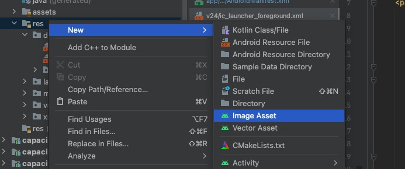
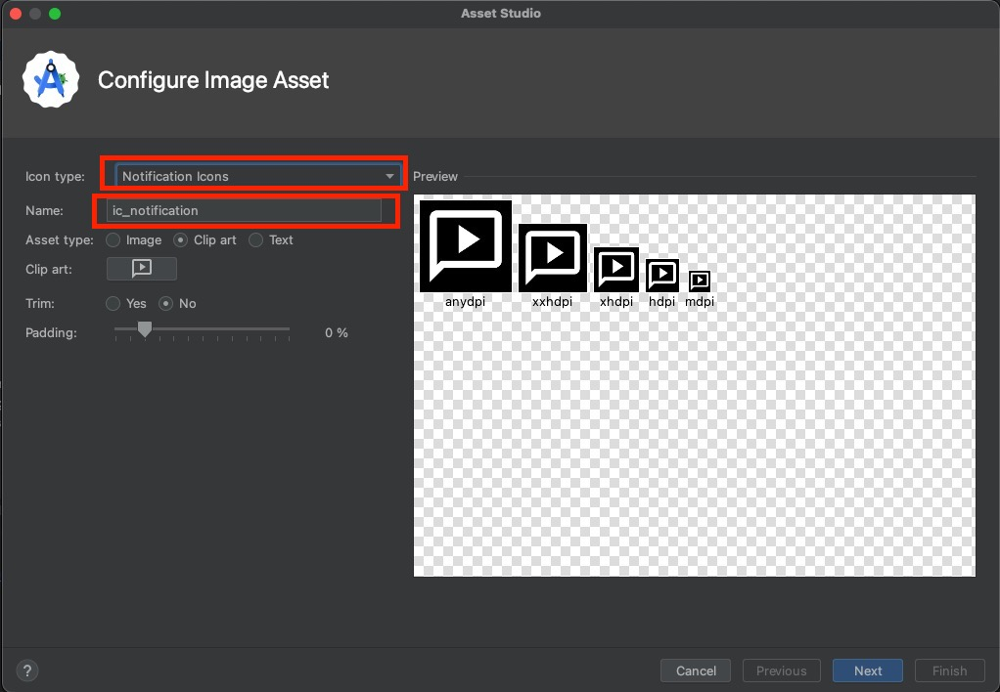

# Installation

```
npm i @dwbn/capacitor-plugin-playlist
npx cap sync
```

### Web

Include HLS.js in your build for HLS streams.

#### Angular example

```
npm i hls.js
```

Add to `angular.json` → architect → build → options → scripts:

```json
"scripts": [
  {
    "input": "node_modules/hls.js/dist/hls.min.js"
  }
]
```

### Android

#### AndroidManifest.xml

The plugin library manifest merges the media playback service and required permissions into your app automatically:

- `android.permission.WAKE_LOCK`
- `android.permission.FOREGROUND_SERVICE`
- `android.permission.FOREGROUND_SERVICE_MEDIA_PLAYBACK`
- `org.dwbn.plugins.playlist.service.MediaService` (`exported="false"`, `foregroundServiceType="mediaPlayback"`)

After upgrading, run `npx cap sync android`. You do **not** need to copy these entries into your host `AndroidManifest.xml` unless you want to override plugin defaults.

Keep your application's existing Android `Application` class. The legacy `org.dwbn.plugins.playlist.App` class remains available for compatibility, but it is no longer required — remove `android:name="org.dwbn.plugins.playlist.App"` from `<application>` when upgrading from older setups.

#### Gradle 9+

On **AGP 9+**, Kotlin is built into the Android Gradle Plugin — do **not** add an extra `kotlin-android` plugin in your host app because of this plugin. Match your project's existing AGP/Kotlin setup.

#### Glide (notification album art)

Create `MyAppGlideModule.java`:

```java
package org.your.package.namespace;

import com.bumptech.glide.annotation.GlideModule;
import com.bumptech.glide.module.AppGlideModule;

@GlideModule
public final class MyAppGlideModule extends AppGlideModule {}
```

See https://guides.codepath.com/android/Displaying-Images-with-the-Glide-Library

#### Notification icon

Create a transparent silhouette icon (e.g. `ic_notification.png`) and pass it via `setOptions`:

```typescript
await Playlist.setOptions({
  verbose: !environment.production,
  options: { icon: 'ic_notification' },
});
```

In Android Studio: right-click `res` → New → Image Asset → Notification Icons.





### iOS

Add to `Info.plist`:

```xml
<key>UIBackgroundModes</key>
<array>
    <string>audio</string>
    <string>fetch</string>
</array>
```

Without `audio` background mode, iOS stops playback when the app backgrounds.

Offline FairPlay downloads use a plugin-owned `AVAssetDownloadURLSession`. Forward the system callback (Story 59.6 wires this in the host app):

```swift
import PlaylistPlugin

func application(_ application: UIApplication,
                 handleEventsForBackgroundURLSession identifier: String,
                 completionHandler: @escaping () -> Void) {
    AudioOffline.handleEventsForBackgroundURLSession(identifier, completionHandler: completionHandler)
}
```


### Android: Media3 and notifications

1. **Pin one Media3 version** when the same APK also uses another Media3 library (for example a native fullscreen video player). Gradle can otherwise unify to an old transitive. In `android/variables.gradle` (or `ext`):

   ```gradle
   media3Version = '1.11.1'
   ```

   In the root `android/build.gradle`:

   ```gradle
   allprojects {
       configurations.configureEach {
           resolutionStrategy {
               eachDependency { details ->
                   if (details.requested.group == 'androidx.media3') {
                       details.useVersion rootProject.ext.media3Version
                   }
               }
           }
       }
   }
   ```

2. **Android 13+ (API 33+):** declare `android.permission.POST_NOTIFICATIONS` in your **host** `AndroidManifest.xml` and request it at runtime when not granted. This plugin does not merge that permission — without it, media notifications may not appear.
3. Minimum SDK **24**.

### Audio and video in one app

If the same Android app plays background audio with this plugin **and** native video with Media3, use **one** `media3Version` in Gradle (snippet above). Mixed Media3 versions in one APK are unsupported.

This plugin’s MediaSession id is **`org.dwbn.playlist`**. Any second Media3 session in the same process (typical for a fullscreen video player) must use a **different** id — [`@dwbn/capacitor-video-player`](https://github.com/phiamo/capacitor-video-player) uses **`org.dwbn.video`**. Media3 forbids two empty or duplicate session ids.

## Platform notes

### Android

Uses Media3 `ExoPlayer` inside `MediaService` (`MediaSessionService`). Notification and lock-screen controls come from Media3 `DefaultMediaNotificationProvider`. Media session id is **`org.dwbn.playlist`**. The notification channel (`Audio playback`) is created by the plugin — hosts do not configure it.

### iOS

Uses a customized AVQueuePlayer (`AVBidirectionalQueuePlayer`) for track-change feedback and continuous audio session between songs. Minimum iOS **18**. CocoaPods and Swift Package Manager are both supported.

Next: [Usage](./usage.md) · [Protected playback (DRM)](./drm.md) · [Video handoff](./video-handoff.md)
