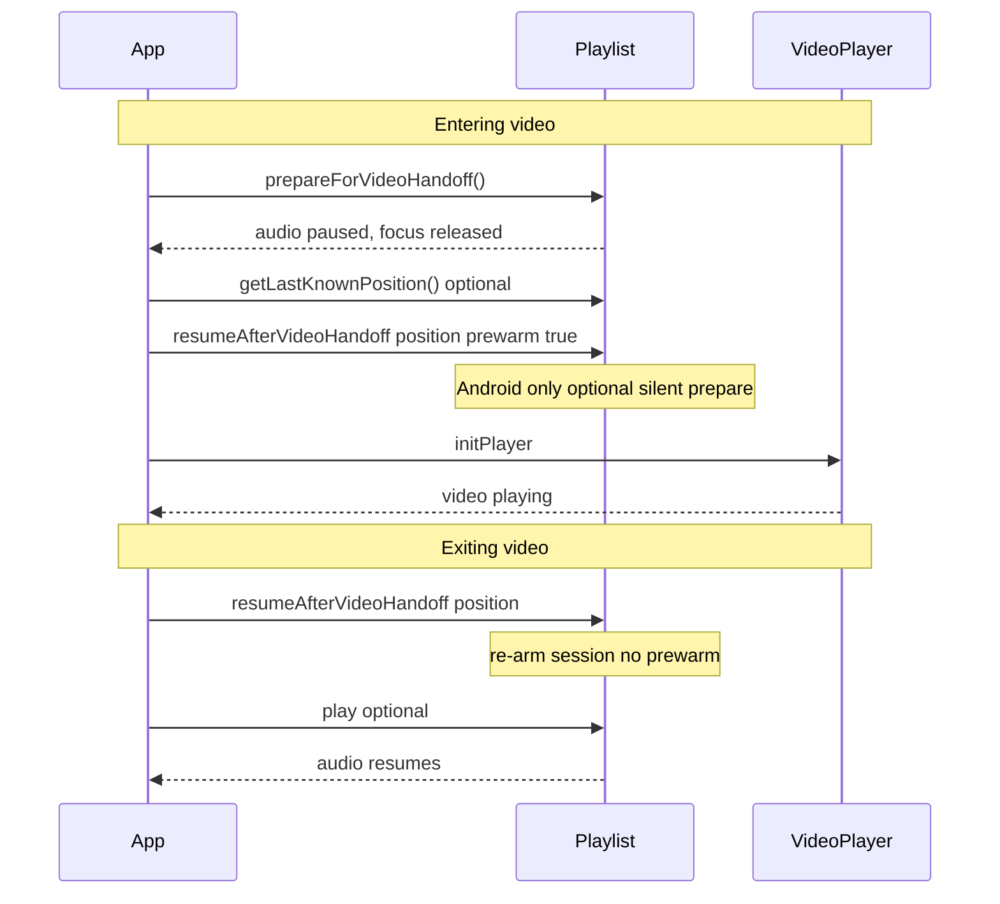
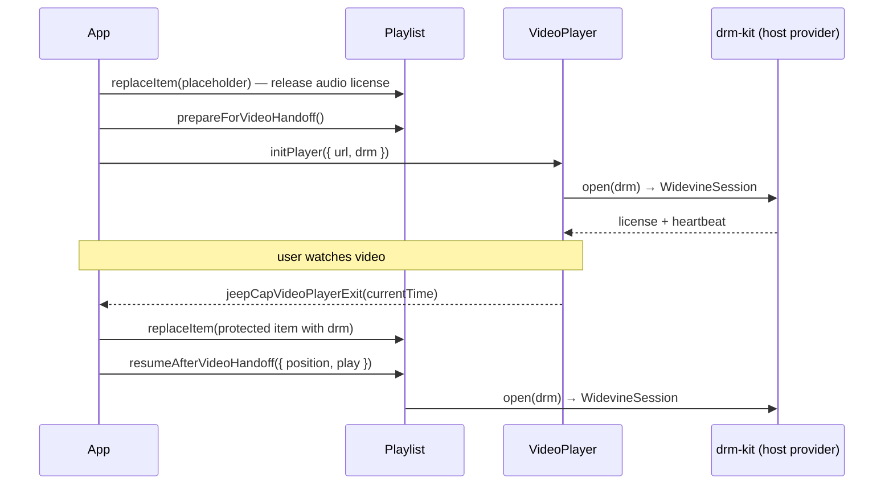

# Audio ↔ video handoff

Native audio and native fullscreen video cannot share audio focus. These three methods coordinate a clean handoff when the user opens video while audio was playing (or when switching back to audio after video).

Works with any native Capacitor video plugin (or other player) that needs exclusive audio focus. The reference pairing is [`@dwbn/capacitor-video-player`](https://github.com/phiamo/capacitor-video-player); the [complete example](#complete-example-with-dwbncapacitor-video-player) below uses it. Protected (Widevine) content is covered in [Handoff with DRM](#handoff-with-drm).

## Methods

| Method | Purpose |
|--------|---------|
| `prepareForVideoHandoff()` | Pause audio, capture head position, release audio focus / session; Android retains FGS |
| `getLastKnownPosition()` | Read captured position (seconds) after prepare |
| `resumeAfterVideoHandoff({ position, prewarm?, play? })` | Re-arm audio after video, or silently prepare at position (optional Android prewarm). `play` decides whether native resumes audibly (Android defaults to `true`, iOS to `false`) |

Call these on the `Playlist` plugin directly — they are **not** exposed on `RmxAudioPlayer`.

## Lifecycle



## Basic sequence

```typescript
import { Playlist } from '@dwbn/capacitor-plugin-playlist';

// --- Entering native video ---
await Playlist.prepareForVideoHandoff();
const { position: audioPosition } = await Playlist.getLastKnownPosition();

await nativeVideoPlayer.init({ /* url, fullscreen, … */ });

// --- Exiting native video (use video head, not audioPosition) ---
const videoPosition = 120; // from your video player's position events
const { resumed } = await Playlist.resumeAfterVideoHandoff({ position: videoPosition });
if (!resumed) {
  await Playlist.play(); // in-place Android resume already played; skip to avoid a stutter
}
```

## Optional Android prewarm

The foreground service is retained when you call `prepareForVideoHandoff`, so many apps only need the [basic sequence](#basic-sequence). If you still see focus / foreground-service edge cases, you may **optionally** prewarm before video:

On Android 14+ (especially Android 17), starting or re-promoting the media foreground service from the background can still fail in some flows. **Prewarm while the app is still visible** if you need it:

```typescript
// 1. Release audio focus
await Playlist.prepareForVideoHandoff();

// 2. Prewarm FGS silently at the video start position (Android)
await Playlist.resumeAfterVideoHandoff({
  position: Math.floor(videoStartSec),
  prewarm: true,
});

// 3. Start native video
await nativeVideoPlayer.init({ /* … */ });

// … user watches video; track video position via player events …

// 4. After video closes — re-arm without prewarm
const { resumed } = await Playlist.resumeAfterVideoHandoff({ position: Math.floor(videoExitSec) });
if (!resumed) {
  await Playlist.play();
}
```

**What `prewarm: true` does on Android:**

- Prepares the playlist item at `position` but stays **silent** — no audio focus request, no audible playback
- Does **not** create FGS; retain already started on `prepareForVideoHandoff`
- Prevents video sound from dropping when audio would otherwise re-request focus
- During prewarm, `Playlist.play()` is a no-op for audible playback (only keeps FGS notification updated)

**iOS:** `prewarm` is accepted but ignored. Use `prepareForVideoHandoff()` → video → `resumeAfterVideoHandoff({ position })` → `play()`.

**Web:** Both methods are stubs (pause + store position). No native session handoff.

## Complete example with `@dwbn/capacitor-video-player`

A condensed version of what the DWBN Awareness app does in production. Audio plays through the playlist plugin; opening a video pauses it, plays fullscreen native video, and continues audio at the video's position when the user leaves the player.

```typescript
import { Capacitor, PluginListenerHandle } from '@capacitor/core';
import { Playlist } from '@dwbn/capacitor-plugin-playlist';
import { CapacitorVideoPlayer } from '@dwbn/capacitor-video-player';

const playerId = 'fullscreen';
let videoHead = 0; // seconds, kept fresh while the video plays
let listeners: PluginListenerHandle[] = [];

async function openVideo(url: string, startAt: number) {
  // 1. Hand audio focus over — immediately before the video starts, never after.
  await Playlist.prepareForVideoHandoff();
  if (Capacitor.getPlatform() === 'android') {
    // Optional: silent prewarm while the app is still visible (Android 14+ FGS rules).
    await Playlist.resumeAfterVideoHandoff({ position: Math.floor(startAt), prewarm: true });
  }

  // 2. Track the video head so audio can continue from there.
  listeners = [
    await CapacitorVideoPlayer.addListener('jeepCapVideoPlayerPositionUpdate', (e) => {
      videoHead = e.currentTime ?? videoHead;
    }),
    await CapacitorVideoPlayer.addListener('jeepCapVideoPlayerExit', (e) => closeVideo(e.currentTime)),
  ];

  // 3. Start native fullscreen video at the audio position.
  await CapacitorVideoPlayer.initPlayer({ mode: 'fullscreen', playerId, url, seektime: startAt });
}

let closing: Promise<void> | null = null;
function closeVideo(exitTime?: number): Promise<void> {
  // Native may report exit more than once (back button + dismiss); handle it once.
  closing ??= (async () => {
    // Prefer the freshest head: exit payload, last tick, or what native persisted.
    const last = await CapacitorVideoPlayer.getLastKnownPosition({ playerId }).catch(() => undefined);
    const position = Math.round(Math.max(exitTime ?? 0, videoHead, Number(last?.value) || 0));

    // 4. Re-arm audio at the video head. `resumeAfterVideoHandoff` must resolve before seekTo/play.
    const { resumed } = await Playlist.resumeAfterVideoHandoff({ position, play: true });
    if (!resumed) {
      await Playlist.seekTo({ position });
      await Playlist.play();
    }
    await Promise.all(listeners.map((l) => l.remove()));
    listeners = [];
  })().finally(() => (closing = null));
  return closing;
}
```

Things the production app adds on top, worth copying once the basics work:

- **Pause before navigating.** It pauses audio and waits a moment before routing to the native video page, so audio focus settles before the video surface opens.
- **Persist the video head.** It writes the head to storage every few seconds, so audio can resume at the right position after a cold start (for example after an Android PiP window is dismissed).
- **Merge concurrent exits.** Several native exit events can arrive together; they are merged into one `resumeAfterVideoHandoff` call using `max(position)`.

## Handoff with DRM

When audio and video are Widevine-protected (Android), both plugins get their licenses from the **host app**, not from the plugins themselves. The host adds [drm-kit](https://github.com/phiamo/drm-kit) and registers one provider for each plugin — see [drm.md](./drm.md) for the setup.

Extra rules during a protected handoff:

1. **One stream at a time.** Licenses may carry a concurrent-stream limit. Before starting protected video, make sure the audio item no longer holds a license — for example by replacing the current audio item with a placeholder before `prepareForVideoHandoff`. Otherwise the video license request fails with `blockedByStreamLimit` or `notEntitled`.
2. **Restore the audio item after video.** Before `resumeAfterVideoHandoff`, put the protected item back with `Playlist.replaceItem(...)` (including its `drm` field), or the player resumes on the placeholder.
3. **Don't auto-retry `blockedByStreamLimit`.** Tell the user another device or stream is active.
4. **iOS and web** reject items with `drm` (`notSupported`) until FairPlay lands, so only send `drm` on Android.



## Platform behaviour

| Step | Android | iOS | Web |
|------|---------|-----|-----|
| `prepareForVideoHandoff` | Pause, abandon audio focus, store position, retain FGS (do not stop) | Pause, store track time, `AVAudioSession.setActive(false)` | Pause HTMLAudioElement, store `currentTime` |
| `getLastKnownPosition` | Returns stored handoff position (seconds) | Same | Same |
| `resumeAfterVideoHandoff` (no prewarm) | In-place play-then-seek if FGS still foreground (retain starts on `prepareForVideoHandoff`); otherwise `{ resumed: false }` so JS may play/seek | Reactivate audio session; reset track-id guard for PLAYING events | Store position only |
| `resumeAfterVideoHandoff` (prewarm) | Silent prepare at position; FGS already retained from prepare; `{ resumed: false }` | No-op | N/A |
| After resume | If `{ resumed: true }`, skip `play()` / `seekTo`. If `false`, JS may play/seek | Call `play()` if audible resume is wanted | Call `play()` on web player |

## Position: audio vs video head

- **`getLastKnownPosition()`** after `prepareForVideoHandoff` — last **audio** head before video opened. Useful if video never started or for debugging.
- **On video exit** — pass the **video** playback position (from your video player's position events), not the stale audio position, so audio resumes where the user left off in the video timeline.
- Track video head while video plays and persist it if the app may cold-start (e.g. after PiP dismiss on Android).

## Integration checklist

1. Call `prepareForVideoHandoff()` **immediately before** your native video player starts — never after.
2. **(Optional, Android)** Call `resumeAfterVideoHandoff({ position, prewarm: true })` after prepare and before video init while the WebView is foregrounded — only if you need prewarm (see [Platform behaviour](#platform-behaviour)).
3. On video exit, call `resumeAfterVideoHandoff({ position })` **without** `prewarm`. If `{ resumed: true }`, skip `play()` / `seekTo`; if `false`, JS may play/seek.
4. `resumeAfterVideoHandoff` must complete before `seekTo()` / `play()` on the audio side.
5. Do not call `Playlist.release()` between prepare and resume unless you intend to tear down the native player entirely.
6. Idempotent exit handling: guard against duplicate `resumeAfterVideoHandoff` calls from concurrent native exit events (merge to a single call with `max(position)`).

## Common pitfalls

| Symptom | Likely cause |
|---------|----------------|
| Video has no sound shortly after start | Audio re-requested focus after prepare; try optional Android `prewarm: true` before video |
| Audio silent after long video session | Foreground service stopped while backgrounded; use in-place resume on exit (`{ resumed }`) and optionally prewarm before long videos |
| JS stuck in PAUSED after video (iOS) | Missing `play()` after resume — on iOS pass `play: true` or call `play()` yourself |
| `PLAYBACK_POSITION` pause while backgrounded | Expected — position events are suppressed while the WebView is backgrounded; one snapshot is sent on resume |
| Two Media3 sessions crash on Android | Both plugins need distinct MediaSession ids: `org.dwbn.playlist` and `org.dwbn.video` (the defaults) |
| DRM video fails with `notEntitled` right after audio played | The audio item still holds the concurrent-stream slot; see [Handoff with DRM](#handoff-with-drm) |

Fixes in older releases are listed in [legacy.md](./legacy.md#handoff-fixes-by-version).
